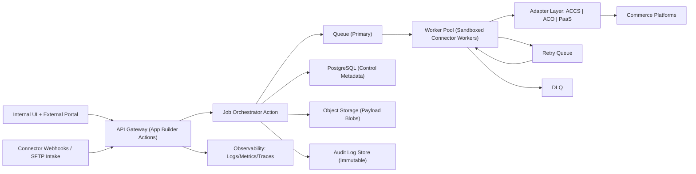

# ACCS-First Catalog Creator Control Plane v1.0 (App Builder, Multi-Platform, Tenant-Isolated)

## Summary
Build a greenfield Catalog Creator control plane on Adobe App Builder that exposes one canonical API for internal and external users, executes writes to ACCS in Phase 1, and keeps ACO/PaaS behind adapter interfaces so no client API changes are needed later.
This plan is optimized for:
1. Tenant-per-company isolation.
2. Event-driven async processing.
3. SOC2 + GDPR-ready controls.
4. Mid-market scale (up to ~500k SKUs, bursty import workloads).
5. Progressive rollout with feature flags and tenant allowlists.
6. Federated SSO with local fallback accounts.
7. API-driven tenant provisioning with approval workflow.
8. Sandboxed connector workers for PIM/ERP integrations.

## Current-State Grounding (from this instance)
1. The current repository is an EDS storefront codebase, not an App Builder backend scaffold.
2. ACCS/B2B REST usage patterns already exist in Cypress support helpers (`/V1/company`, `/V1/sharedCatalog`, assign products/prices).
3. Dual scope conventions are already present for ACCS/PaaS-style headers and ACO-style headers.
4. Existing storefront behavior depends on current config header model, which must remain backward compatible.
5. No existing canonical catalog job API or async job orchestration layer is implemented yet.

## Business Goals and Measurable Outcomes
| Goal | Metric | Target |
|---|---|---|
| Single API surface | % catalog operations invoked via canonical API | 100% of new integrations |
| Faster onboarding | Time to onboard a new tenant+connector | < 2 business days |
| Reliable processing | Monthly API availability | >= 99.5% |
| Deterministic retries | Duplicate event dedupe rate | 100% by idempotency key |
| Operational visibility | Jobs with correlation ID and trace coverage | 100% |
| Security/compliance readiness | SOC2/GDPR controls implemented and auditable | Phase 1 exit gate |
| Scale safety | Sustained throughput | 50 jobs/min sustained, 300 jobs/min burst |

## Scope and Non-Goals
### In Scope
1. Canonical API for jobs, assignments, connectors, tenant provisioning, replay, and status.
2. ACCS execution adapter for product/price/assignment/publish flows.
3. ACO and PaaS adapters scaffolded and contract-tested behind feature flags.
4. PIM and ERP connector framework with webhook + file ingestion entrypoints.
5. Tenant isolation, RBAC, audit logging, and secrets segregation.
6. Async orchestration engine with retry and DLQ.
7. Observability stack with SLO dashboards and runbooks.
8. Progressive rollout controls and kill switches.

### Out of Scope (Phase 1)
1. Full self-service billing for external tenants.
2. Cross-region active-active writes.
3. Marketplace syndication connectors beyond PIM/ERP.
4. Advanced AI enrichment workflows for catalog copy/media.
5. Customer-facing storefront runtime refactors.

## Target Architecture (Decision-Complete)


## Component Boundaries and Responsibilities
| Component | Responsibility | Runtime | Storage/External |
|---|---|---|---|
| API Gateway Actions | AuthN/AuthZ, schema validation, idempotency gate, request admission | App Builder Runtime | PostgreSQL |
| Job Orchestrator | Persist job, create execution graph, enqueue work | App Builder Runtime | PostgreSQL + Queue + Blob |
| Worker Pool | Execute adapter operations, retries, partial-failure isolation | App Builder Runtime (separate action packages) | Queue + Platform APIs |
| Adapter SDK | `validate`, `transform`, `execute`, `publish`, `rollback`, `health` | TypeScript package | None |
| Connector Workers | Normalize PIM/ERP events, map to canonical payload | Sandboxed action packages | Queue + Blob |
| Control DB | Job metadata, tenant model, RBAC, connector config | Managed PostgreSQL | Backups + PITR |
| Payload Store | Large payload snapshots and replay artifacts | Object storage | KMS encryption |
| Audit Service | Immutable append-only audit events | Action + WORM-compatible store | Retention policies |
| Observability | Correlation, trace, metrics, alerting | APM/log stack | Dashboards/alerts |

## Environment and Deployment Topology
| Environment | Purpose | Data Policy | Release Policy |
|---|---|---|---|
| `dev` | Developer integration testing | Synthetic data only | Continuous |
| `int` | Contract/integration tests with sandbox platforms | Masked data | Daily |
| `stage` | Pre-prod validation and load tests | Production-like masked data | Weekly |
| `prod` | Tenant traffic | Real data | Progressive rollout with allowlists |

## Public API Changes (Canonical Surface)
### 1) `POST /v1/catalog-jobs`
1. Purpose: submit async job for `UPSERT_PRODUCT`, `UPSERT_PRICE`, `ASSIGN_CATALOG`, `PUBLISH`.
2. Headers required: `Authorization`, `X-Tenant-Id`, `Idempotency-Key`, `X-Correlation-Id`.
3. Request body fields:
| Field | Type | Required | Notes |
|---|---|---|---|
| `operationType` | enum | yes | `UPSERT_PRODUCT`, `UPSERT_PRICE`, `ASSIGN_CATALOG`, `PUBLISH` |
| `targetPlatforms` | enum[] | yes | `ACCS`, `ACO`, `PAAS` |
| `payloadRef` | string | yes | blob URI or inline token |
| `source` | object | yes | connector/user metadata |
| `executionMode` | enum | no | default `ASYNC` |
| `dryRun` | boolean | no | default `false` |
4. Response: `202 Accepted` with `jobId`, `status=QUEUED`, `acceptedAt`, `correlationId`.
5. Idempotency behavior: same tenant + same key within 72h returns original `jobId`.

### 2) `GET /v1/catalog-jobs/{jobId}`
1. Purpose: retrieve full job graph and per-platform status.
2. Response fields:
| Field | Type | Notes |
|---|---|---|
| `jobId` | string | canonical UUID |
| `status` | enum | `QUEUED`, `RUNNING`, `PARTIAL_SUCCESS`, `SUCCESS`, `FAILED`, `CANCELLED` |
| `platformResults` | array | one record per target platform |
| `attempts` | int | total attempts |
| `retryCount` | int | retries used |
| `timeline` | array | state transitions with timestamps |
| `errors` | array | normalized error objects |
| `correlationId` | string | end-to-end trace key |

### 3) `POST /v1/catalogs/{catalogId}/assignments`
1. Purpose: assign tenants/companies/groups/channels against catalog entities.
2. Request fields:
| Field | Type | Required |
|---|---|---|
| `assignmentType` | enum (`COMPANY`,`CUSTOMER_GROUP`,`CHANNEL`) | yes |
| `targetId` | string | yes |
| `includeRules` | object[] | no |
| `excludeRules` | object[] | no |
| `effectiveFrom` | datetime | no |
| `effectiveTo` | datetime | no |
3. Response: `202 Accepted` with generated assignment job linkage.

### 4) `POST /v1/connectors/{connectorId}/events`
1. Purpose: ingress endpoint for PIM/ERP webhooks and file-import notifications.
2. Required controls: connector signature verification, replay protection nonce, per-connector rate limits.
3. Response: `202 Accepted` with normalized event ID and linked catalog job ID when applicable.

### 5) Additional operational endpoints required for production
1. `POST /v1/catalog-jobs/{jobId}/replay`
2. `POST /v1/catalog-jobs/{jobId}/cancel`
3. `GET /v1/catalog-jobs/{jobId}/artifacts`
4. `GET /v1/adapters/health`
5. `POST /v1/tenants`
6. `POST /v1/tenants/{tenantId}/connectors`
7. `GET /v1/audit/events`

## Canonical Interfaces and Types
### Core Types
| Type | Required Fields |
|---|---|
| `CatalogProduct` | `sku`, `name`, `attributes`, `categories`, `media`, `lifecycle`, `locale`, `version` |
| `CatalogPrice` | `sku`, `currency`, `amount`, `scopeType`, `scopeId`, `effectiveFrom`, `effectiveTo` |
| `CatalogAssignment` | `catalogId`, `assignmentType`, `targetId`, `includeRules`, `excludeRules` |
| `CatalogJob` | `jobId`, `tenantId`, `operationType`, `targets`, `payloadRef`, `idempotencyKey`, `status`, `timeline` |

### Adapter Contract (internal SDK)
```ts
interface CatalogAdapter {
  platform: "ACCS" | "ACO" | "PAAS";
  validate(input: CanonicalOperation): Promise<ValidationResult>;
  transform(input: CanonicalOperation): Promise<PlatformPayload>;
  execute(payload: PlatformPayload, ctx: ExecutionContext): Promise<ExecutionResult>;
  publish(result: ExecutionResult, ctx: ExecutionContext): Promise<PublishResult>;
  rollback(result: ExecutionResult, ctx: ExecutionContext): Promise<RollbackResult>;
  health(ctx: HealthContext): Promise<HealthReport>;
}
```

### Error Contract (uniform)
| Field | Type | Notes |
|---|---|---|
| `code` | string | stable machine code |
| `category` | enum | `VALIDATION`, `AUTH`, `RATE_LIMIT`, `UPSTREAM`, `INTERNAL` |
| `message` | string | sanitized |
| `retryable` | boolean | retry policy driver |
| `platform` | enum | optional |
| `upstreamStatus` | int | optional |
| `correlationId` | string | required |

## Tenant Isolation and Identity Model
### Identity
1. Primary auth: federated OIDC/SAML.
2. Fallback auth: local managed accounts with mandatory MFA and restricted scopes.
3. Token claims required: `sub`, `tenant_id`, `roles`, `session_id`.

### Tenant Isolation Controls
1. Every record carries `tenant_id` and is protected by row-level access policy.
2. Connector secrets are isolated per tenant namespace and per connector.
3. Payload blobs use `tenant_id` path prefixes and key-wrapped encryption.
4. Audit event queries are tenant-scoped unless global compliance role is present.
5. Queue messages carry tenant context and are never batch-mixed across tenants in a single execution transaction.

### RBAC Matrix
| Role | Submit Jobs | Manage Connectors | Replay/Cancel | View Audit | Manage Tenants |
|---|---|---|---|---|---|
| `platform_admin` | yes | yes | yes | yes | yes |
| `tenant_admin` | yes | yes | yes | yes | no |
| `merch_manager` | yes (product/assignment) | no | no | limited | no |
| `pricing_manager` | yes (price) | no | no | limited | no |
| `connector_operator` | no | yes | no | limited | no |
| `audit_viewer` | no | no | no | yes | no |
| `partner_submitter` | yes (scoped) | no | no | own-only | no |

## Data Model and Persistence Plan
| Entity | Purpose | Retention |
|---|---|---|
| `tenants` | tenant registry and compliance attributes | indefinite |
| `users_roles` | RBAC bindings | lifecycle + 1 year |
| `connectors` | connector definitions and state | lifecycle + 1 year |
| `connector_secrets_ref` | secret references only (no plaintext) | lifecycle |
| `catalog_jobs` | job headers and status | 18 months |
| `job_attempts` | retry attempts and timing | 18 months |
| `job_platform_results` | per-platform execution outputs | 18 months |
| `job_events` | timeline append log | 18 months |
| `payload_blobs` | payload snapshots and normalized manifests | 90 days default |
| `audit_events` | immutable compliance log | 7 years |
| `dsr_requests` | GDPR request tracking | 7 years |
| `feature_flags` | rollout control | lifecycle |

## Processing Semantics, Retry, and DLQ
1. Queue ack happens only after idempotent persistence of attempt result.
2. Retry schedule: `1m`, `5m`, `15m`, `60m`, `6h`, `24h`, then DLQ.
3. Maximum attempts: 7 retries + 1 initial attempt.
4. Retryable categories: `RATE_LIMIT`, transient `UPSTREAM`, transient `INTERNAL`.
5. Non-retryable categories: schema validation, authz failures, unsupported operation.
6. Partial failure model: platform failures do not roll back successful platforms unless operation is marked `atomic=true`.
7. Replay model: operator-triggered replay creates a new attempt chain linked to original job and same canonical payload hash.

## Platform Execution Mapping
### ACCS Adapter (Phase 1 active)
1. `UPSERT_PRODUCT`: map canonical product to ACCS-compatible product APIs and category assignment APIs.
2. `UPSERT_PRICE`: map price scope to customer group/price book behavior and shared-catalog tier pricing endpoints where applicable.
3. `ASSIGN_CATALOG`: use shared-catalog/company/product assignment flows.
4. `PUBLISH`: trigger cache/index invalidation and downstream readiness checks.
5. Auth model: IMS service credentials with per-tenant credential references.

### ACO Adapter (Phase 2 switch-on)
1. Scope mapping uses `ac-view-id`, `ac-price-book-id`, `ac-scope-locale`.
2. Product/price transforms are implemented now and executed under feature flag in stage first.
3. Compatibility report emitted for each dry run before production enablement.

### PaaS Adapter (Phase 2 switch-on)
1. Scope mapping uses store/store-view/website conventions.
2. Execution uses Magento REST/GraphQL store-scoped write APIs.
3. Compatibility checks enforce field parity with canonical contracts.

### Cross-Platform Contract Rule
1. Client requests never include platform-specific payload shapes.
2. Platform-specific fields are represented in canonical `extensions` object with strict validation per adapter.

## Connector Framework (PIM + ERP First)
### Connector Types in Phase 1
1. `PIM_WEBHOOK_CONNECTOR` for product/attribute/category/media updates.
2. `ERP_EVENT_CONNECTOR` for price/availability/contract updates.
3. `FILE_DROP_CONNECTOR` for controlled CSV/JSON bulk loads (fallback path).

### Connector Worker Contract
| Stage | Behavior |
|---|---|
| `verify` | signature, timestamp skew, replay nonce |
| `normalize` | map external payload to canonical schema |
| `enrich` | lookup dictionaries, resolve tenant mappings |
| `emit` | create catalog job with idempotency key |
| `ack` | send success/failure callback to source system |

## Security, Privacy, and Compliance Controls (SOC2 + GDPR-Ready)
1. Encryption in transit via TLS 1.2+ and at rest with KMS-managed keys.
2. Secrets in managed vault, never persisted in plaintext application tables.
3. Immutable audit trail for all privileged actions and data mutations.
4. Principle of least privilege for runtime actions and connector workers.
5. PII minimization: catalog payloads exclude customer PII by schema.
6. GDPR data subject request flow for export/delete/anonymization where applicable.
7. Retention policy enforcement jobs with legal hold override support.
8. Threat model delivered before production, updated quarterly.
9. Security testing gates: SAST, dependency scan, secret scan, DAST on stage.
10. Incident response runbook with severity matrix and 24h breach triage SLA.

## Observability and SRE Plan
### Required Telemetry
| Signal | Required Fields |
|---|---|
| Logs | `timestamp`, `service`, `tenant_id`, `job_id`, `correlation_id`, `severity`, `code` |
| Metrics | queue depth, job latency p50/p95/p99, retry count, DLQ rate, adapter success rate |
| Traces | span per API request, orchestrator enqueue, worker execution, adapter upstream calls |
| Audit | actor, action, entity, before/after hash, approval chain |

### SLOs and Alerting
1. API availability SLO: 99.5% monthly.
2. Job completion SLO: 95% within 15 minutes for standard payload size.
3. Alert thresholds:
| Condition | Threshold |
|---|---|
| DLQ rate spike | > 2% for 15 min |
| Adapter failure rate | > 5% for 10 min |
| Queue lag | > 20 min |
| Auth failures | > 3x baseline for 10 min |

## Rollout and Migration Strategy (Progressive)
### Rollout Mechanics
1. Feature flags by operation and by target platform.
2. Tenant allowlist waves with rollback checkpoint after each wave.
3. Shadow mode for connectors before write enablement.
4. Kill switch for each adapter and connector independently.

### Wave Plan
| Wave | Scope | Exit Criteria |
|---|---|---|
| Wave 0 | Internal sandbox tenants only | zero P1 incidents, pass contract tests |
| Wave 1 | 3 pilot tenants (ACCS only) | >98% success, no data leakage findings |
| Wave 2 | 20 tenants | stable SLO for 2 weeks |
| Wave 3 | General availability for ACCS features | security and ops sign-off |
| Wave 4 | ACO enablement for allowlist tenants | compatibility report clean |
| Wave 5 | PaaS enablement for allowlist tenants | parity and rollback validated |

## Delivery Plan with Workstreams and Exit Gates
### Phase 0 (Weeks 1-2): Foundation and Contracts
1. Deliverables:
| Deliverable | Owner |
|---|---|
| OpenAPI spec for v1 endpoints | API Lead |
| JSON Schemas for canonical types | Data Model Lead |
| RBAC policy matrix and auth flows | Security Lead |
| ADR set (storage, queue, adapter contract) | Architecture Lead |
| Threat model v1 | Security Lead |
2. Exit Gate: architecture and compliance review approved.

### Phase 1 (Weeks 3-12): Production ACCS Path
1. Deliverables:
| Deliverable | Owner |
|---|---|
| API Gateway + orchestrator actions | Platform Team |
| PostgreSQL schema + migrations | Data Team |
| Queue/retry/DLQ pipeline | Platform Team |
| ACCS adapter execute path | Commerce Integration Team |
| PIM/ERP connector workers | Integration Team |
| Audit + observability stack | SRE Team |
| Internal and external portal MVP | Frontend Team |
2. Exit Gate: pilot tenants processing production jobs with SLO adherence.

### Phase 2 (Weeks 13-18): ACO + PaaS Enablement
1. Deliverables:
| Deliverable | Owner |
|---|---|
| ACO adapter execution enablement | Commerce Integration Team |
| PaaS adapter execution enablement | Commerce Integration Team |
| Dry-run compatibility reports | Data/QA Team |
| Cross-platform conformance tests | QA Team |
2. Exit Gate: staged tenant rollout with stable error budgets.

### Phase 3 (Weeks 19-21): Hardening and Scale
1. Deliverables:
| Deliverable | Owner |
|---|---|
| Replay UI and operator controls | Platform Team |
| Quotas/throttling and abuse controls | Security/SRE |
| Load/performance tuning | SRE |
| Runbooks and on-call training | SRE/Operations |
2. Exit Gate: GA readiness checklist complete.

## Test Cases and Scenarios (Expanded)
### Contract and Schema
1. Validate each endpoint against OpenAPI and JSON Schema golden files.
2. Reject unknown fields unless explicitly allowed in `extensions`.
3. Verify canonical-to-platform transform determinism with fixture snapshots.

### Functional
1. Submit ACCS-only `UPSERT_PRODUCT` job and confirm stable completion.
2. Submit multi-platform job and verify isolated per-platform status progression.
3. Submit duplicate connector event and confirm same `jobId` returned.
4. Run `ASSIGN_CATALOG` with include/exclude rules and verify platform assignment parity.
5. Trigger `PUBLISH` and verify downstream readiness probes.

### Failure and Resilience
1. Simulate upstream 429 and ensure retry policy and jitter execution.
2. Simulate non-retryable validation error and confirm immediate failure classification.
3. Force one platform hard fail in multi-target job and verify partial success semantics.
4. Replay DLQ item and verify auditable replay chain.

### Security and Isolation
1. Cross-tenant token access attempts must return `403` and no metadata leakage.
2. Secret references cannot be listed by non-admin roles.
3. Audit log tamper tests should fail integrity verification checks.

### Compliance and Privacy
1. Retention policy job deletes expired payload blobs on schedule.
2. DSR export returns complete data envelope for tenant-scoped entities.
3. DSR delete/anonymize flow logs legal basis and actor approvals.

### Performance and Scale
1. Sustained test at 50 jobs/min for 2h with p95 completion <= 15 min.
2. Burst test at 300 jobs/min for 10 min with no data loss.
3. Backpressure test validates queue lag alarms and graceful degradation behavior.

### UAT and Rollout Validation
1. Pilot tenant UAT scripts for each operation type.
2. Feature-flag rollback drill during active traffic.
3. On-call runbook simulation for DLQ surge and upstream outage.

## Operational Runbooks Required
1. Upstream outage response (ACCS/ACO/PaaS).
2. Connector signature failure investigation.
3. Job replay and requeue procedures.
4. Tenant isolation incident response.
5. Data retention and legal hold operations.
6. Emergency kill switch activation and rollback.

## Risks and Mitigations
| Risk | Impact | Mitigation |
|---|---|---|
| Upstream API drift in platform adapters | job failures | versioned adapter contracts + smoke tests |
| High connector payload variability | mapping errors | strict schema registry + connector-specific validation |
| Tenant misconfiguration | data leakage risk | approval workflow + policy lints before activation |
| Retry storms during outages | cost/perf degradation | circuit breakers + capped retries + DLQ routing |
| Compliance gaps discovered late | release delay | Phase 0 threat model and control checklist gates |
| Platform parity gaps (ACCS/ACO/PaaS) | inconsistent outcomes | compatibility report + dry-run before enablement |

## Cost and Capacity Guardrails
1. Per-tenant quotas on jobs/day, payload size, and concurrent executions.
2. Queue-based autoscaling with max worker ceiling to cap cost.
3. Blob lifecycle policies for payload retention.
4. Dashboard for cost per successful job by connector and platform.

## Documentation and Governance Artifacts
1. OpenAPI spec (`v1`) and JSON schema catalog.
2. Adapter SDK guide with mandatory conformance tests.
3. Connector onboarding playbook (PIM/ERP templates).
4. Security control matrix mapped to SOC2/GDPR controls.
5. SRE playbook and incident templates.
6. ADR log for all architecture changes.

## Acceptance Criteria (Final)
1. Canonical API supports product, price, assignment, and publish operations asynchronously.
2. ACCS adapter is production-enabled with auditable execution history.
3. ACO/PaaS adapters are deployable behind feature flags without API contract changes.
4. Tenant-per-company isolation is enforced across auth, data, logs, queues, and storage.
5. Idempotency, retry, DLQ, and replay are fully operational and tested.
6. SOC2/GDPR-ready controls are implemented and evidenced.
7. SLO/alerting dashboards are live and on-call runbooks validated.
8. Progressive rollout completed through pilot and GA gates without P1 tenant-isolation incidents.

## Explicit Assumptions and Defaults
1. App Builder Runtime is the control-plane execution environment.
2. Managed PostgreSQL, queue service with DLQ, and object storage are available to the runtime.
3. ACCS APIs required for product/price/assignment writes are accessible with IMS credentials.
4. ACO/PaaS execution starts as disabled-by-default feature flags in production.
5. Mid-market capacity target is sufficient for initial launch profile.
6. Federated SSO integration is available for enterprise tenants; local fallback accounts are limited and MFA-protected.
7. Connector runtime sandboxing is implemented as separate action packages with least-privilege credentials.
8. Existing storefront header conventions remain unchanged and are reused by adapter mapping logic.
