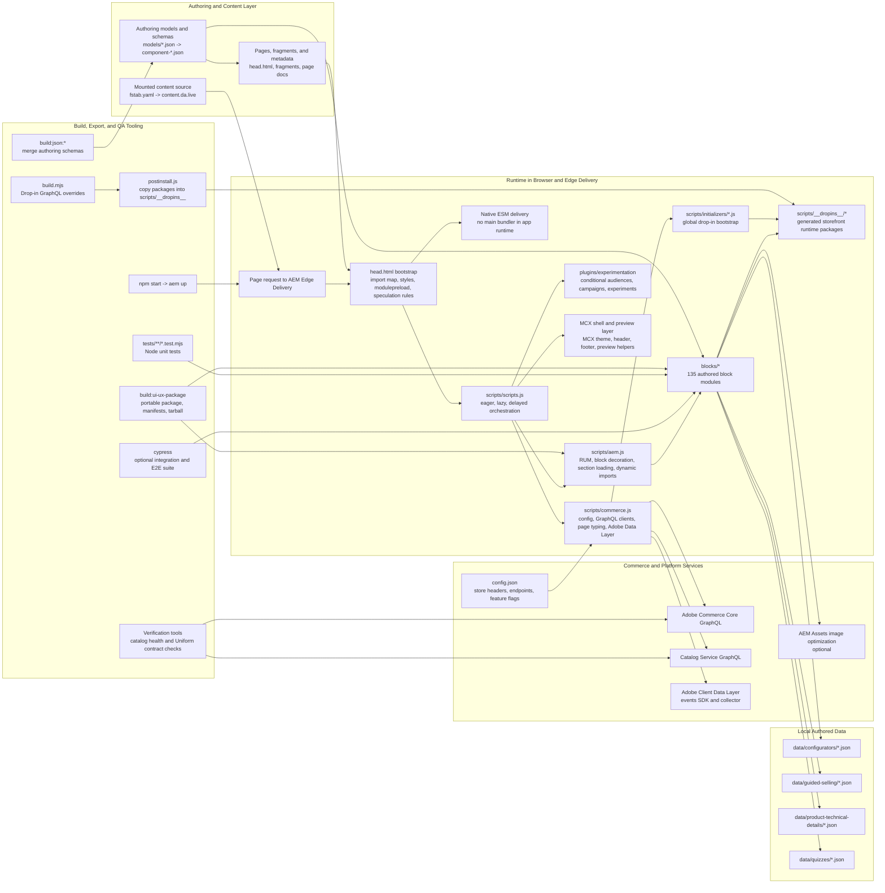
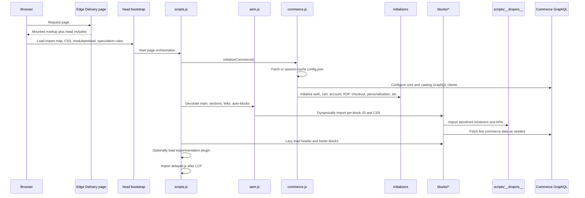

# Build Architecture Diagram

This repository is an Adobe Edge Delivery Services storefront wired to Adobe Commerce. The main application is served as native ESM modules with dynamic block loading, not as a single webpack or Vite bundle. In practice, the "build" is a mix of mounted content, browser-time module orchestration, generated drop-in assets, and a few repo-side packaging and verification scripts.

## System Diagram

## Runtime Load Sequence

## Repository Topology

- `blocks/`: the feature surface of the storefront. The generated inventory reports 135 blocks: 55 commerce, 59 content, 10 interactive-content, 6 forms, and 5 shell blocks.
- `scripts/`: the runtime spine. `scripts.js` orchestrates page load, `aem.js` handles block and section infrastructure, `commerce.js` manages store config and data access, and `initializers/` wires Adobe drop-ins.
- `scripts/__dropins__/`: generated runtime assets copied from `node_modules` during `postinstall`; this is the bridge between authored code and Adobe storefront packages.
- `models/` plus `component-definition.json`, `component-models.json`, and `component-filters.json`: the authoring contract for DA and block modeling.
- `data/` and `fragments/`: authored supporting data for configurators, guided selling, technical details, quizzes, and reusable shell content.
- `plugins/experimentation/`: optional experimentation runtime loaded only when experiment or audience metadata is present.
- `tools/` and `ui-ux-portability-package/`: repo-side tooling for verification, metadata generation, and exporting the UI layer as a portable package.
- `tests/` and `cypress/`: split between fast Node-based unit coverage and optional Cypress integration and end-to-end coverage.

## Key Takeaways

- The live storefront is assembled at runtime from mounted content, metadata, block modules, and Adobe drop-ins.
- There is no single compiled application bundle at the root of this repo; the architecture is block-based and import-map-driven.
- Commerce connectivity is centralized in `scripts/commerce.js`, while feature rendering is distributed across blocks and drop-in initializers.
- The portability package under `ui-ux-portability-package/` is a derived export of the design system and runtime layer, not the primary live application entrypoint.
